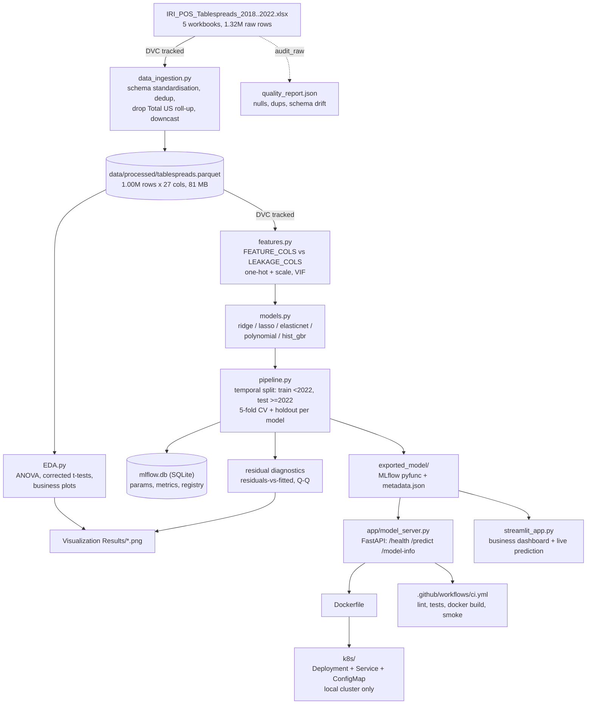

# Architecture

## Pipeline



## Components

**Ingestion (`data_ingestion.py`).** The raw workbooks are the most expensive
thing in the project to touch — five files, ~63 MB each, and openpyxl parsing
dominates total runtime. So they are parsed exactly once and persisted as a
single Parquet that everything downstream reads. Per year the loader standardises
the schema (2022 renames `Product Description` to `Product`), drops exact
duplicates, fills the two null blocks with 0.0, derives `Year`/`Week`/`Brand`,
drops the `Total US` national roll-up, and downcasts to `float32` plus
`category`. `audit_raw()` is a separate pass over the same files that records
what was actually there — null rates, duplicate counts, and a column-by-column
schema comparison against 2018 — into `quality_report.json`, so the cleaning
decisions in `DATA_DICTIONARY.md` cite measurements rather than assumptions.

**Features (`features.py`).** The important thing this module does is *exclude*.
`LEAKAGE_COLS` names every column that is a mechanical component of the target
(`Base *`, `Incremental *`, dollar and volume restatements of the same sale), and
none of them reach the model. What remains is price, distribution breadth, brand,
region, and calendar. Preprocessing one-hot encodes brand and region with
`min_frequency=2000`, which collapses the long tail of ~370 two-token "brands"
into a single infrequent bucket — that keeps the design matrix around 65 columns
instead of 380, and it doubles as the serving-time safety net, since a brand the
model never saw routes to that bucket instead of raising. `vif_report()` computes
variance inflation factors on the numeric block.

**EDA (`EDA.py`).** Reusable functions rather than notebook cells: one-way ANOVA
and pairwise Welch t-tests across years (with Bonferroni and Benjamini-Hochberg
corrections applied, because ten pairwise comparisons at raw α=0.05 will produce
false positives by construction), the three business plots, and the residual
diagnostics for the winning model. Matplotlib runs on the `Agg` backend so it
works headless in CI.

**Training (`pipeline.py`).** The split is **temporal**, not random: train on
everything before 2022, test on 2022 onward. That is the question that matters —
would this model have worked on a year it had never seen — and a random split
would flatter it by letting adjacent weeks of the same product appear on both
sides. Each of the five candidates gets both a 5-fold CV pass over the training
years (stability across resamples) and the temporal holdout score (generalisation
to a future year), with both logged to MLflow along with the seed. Selection is
on the holdout, because that is the deployment question. The winner is exported
as a self-contained MLflow model and registered as `tablespreads_unit_sales`.

**Tracking (`mlflow.db`).** Local SQLite. Disposable by design — it is experiment
tracking, not data. `rm mlflow.db mlruns/` and rerun is always a valid recovery.

**Serving (`app/model_server.py` + `Dockerfile`).** FastAPI loads
`exported_model/` at startup. Because the exported artifact is a complete sklearn
`Pipeline`, the API accepts raw feature values and the pipeline does its own
encoding and scaling — there is no separate preprocessing step to keep in sync
between training and serving, which is the usual source of training/serving skew.

**Dashboard (`streamlit_app.py`).** Loads the exported model directly rather than
calling the API, so it runs standalone on Streamlit Community Cloud with no
backend to host.

**Kubernetes (`k8s/`).** Deployment, Service and ConfigMap for the API against a
free local cluster (kind, minikube, or Docker Desktop). This demonstrates the
deployment pattern; it is deliberately additive and does not replace the plain
`docker run` path for local development.

## Two operational decisions worth recording

### Training runs detached, always

An earlier training run was lost partway through the `polynomial` model when the
editor crashed and killed its integrated terminal, taking the child Python
process with it. This left a stale `RUNNING` row in `mlflow.db`.

The failure had nothing to do with model size or compute. The largest computation
in this project is a degree-2 expansion of 8 numeric features plus one-hot
categoricals — roughly 800k × 65 dense floats, which `Ridge` solves on a laptop
CPU in seconds. The correct fix is process management, not hardware:

```bash
mkdir -p logs
nohup python pipeline.py > logs/train.log 2>&1 &
```

The run then survives the editor, the terminal, and the SSH session. Recovery
from a partial run is `rm -rf mlflow.db mlruns/` followed by a clean rerun —
total runtime is minutes, so checkpoint/resume machinery would be more code than
the thing it saves.

### ZenML orchestration is optional at runtime

`pipeline.py` defines `@step`/`@pipeline` wrappers, but `run()` falls back to
calling the same functions directly if ZenML fails — and that fallback covers
*runtime* failure, not just a missing import. ZenML can import successfully while
still being configured against a tracking server that is not running, which is
exactly what happens on this machine. Training is the thing that must not break:
a fresh clone and a CI runner both need `pip install -r requirements.txt` and
nothing more. The steps executed and the metrics produced are identical on either
path, because the ZenML wrappers only call the plain functions.
