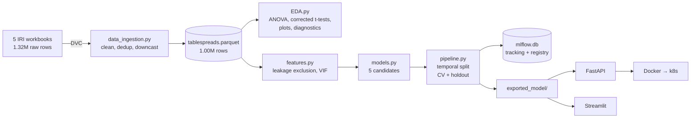

# Predictive Marketing Analytics — Refrigerated Tablespreads


Predicting non-promoted unit sales for the refrigerated tablespreads category
from 1.0M rows of IRI point-of-sale data (2018–2022), with the full MLOps path
around it: versioned data, tracked experiments, a registered model, a served API,
a business dashboard, and CI.

**Headline result: R² = 0.635 on a held-out year the model never saw.**

---

## Table of Contents

- [The number that changed](#the-number-that-changed)
- [Results](#results)
- [Business findings](#business-findings)
- [Architecture](#architecture)
- [Quick start](#quick-start)
- [Serving the model](#serving-the-model)
- [Kubernetes](#kubernetes-local-cluster)
- [Dashboard](#dashboard)
- [Analytical rigor](#analytical-rigor)
- [Repository structure](#repository-structure)
- [Tech stack](#tech-stack)
- [Documentation](#documentation)
- [Author](#author)
- [License](#license)

---

## The number that changed

An earlier version of this analysis reported **~81% accuracy**. That figure was
produced by training on `Base Volume Sales` and related columns. Those are not
predictors — they are arithmetic components of the target:

```
Unit Sales No Merch = Base Unit Sales + Incremental Units
Dollar Sales        = Units × Price
Volume ≡ Units in this dataset, on a different scale
```

The model was being handed the answer and asked to add to it. The high R²
measured that identity, not a learned relationship, and the model could never
have run in production — nobody knows a week's baseline or incremental split
before the week has happened.

All 13 such columns are excluded (`features.py::LEAKAGE_COLS`), and a test
asserts none of them can re-enter the feature set. Evaluation also moved from a
random split to a **temporal** one: train on 2018–2021, test on the unseen 2022+.

**The honest number is 0.635, not 0.81.** The drop is the leakage coming out, not
a worse model. Full reasoning in [`MODEL_CARD.md`](MODEL_CARD.md).

---

## Results

Trained on 808,635 rows (2018–2021), tested on 193,930 unseen rows (2022+).
Seed 42, fixed and logged. Every number reproduces from `python pipeline.py`.

| Model | Holdout R² | CV R² (mean ± std) | Holdout RMSE | Holdout MAE |
|---|---|---|---|---|
| **HistGradientBoosting** ✅ | **0.635** | 0.908 ± 0.002 | 10,003 | 2,270 |
| Polynomial (degree 2) | 0.430 | 0.510 ± 0.005 | 12,491 | 4,508 |
| Ridge | 0.419 | 0.402 ± 0.004 | 12,614 | 4,959 |
| Lasso | 0.419 | 0.402 ± 0.004 | 12,616 | 4,938 |
| ElasticNet | 0.311 | 0.303 ± 0.001 | 13,735 | 4,143 |

Predicting the training mean scores **R² = −0.0002**, which is the floor these
should be read against.

### Why CV says 0.908 and the holdout says 0.635

This gap is the most informative result in the project, so it is reported rather
than buried. CV standard deviation is 0.002 — the model is extremely *stable*,
just stable at a number that does not survive a new year.

K-fold shuffles rows, so week 12 of 2019 for a given product and region lands in
training while week 13 of the same product and region lands in test. A boosted
tree can memorise each product-region's volume level and score very well. The
2022 holdout removes that entirely. **0.635 is the number to quote** — 0.908 is
what this model would have reported under a random split, which is exactly the
kind of result that looks impressive and fails in production.

Selection was made on the holdout, because "does this work on a year it has never
seen" is the deployment question.

---

## Business findings

- **Price and volume move sharply against each other.** The cheapest price decile
  averages **8,829 units at $1.37**; the most expensive averages **1,092 units at
  $9.56**. This is a cross-sectional association across products, not a
  within-product elasticity — it should not be read as "cut price by X, gain Y".
- **Region matters, and it is not noise.** One-way ANOVA across the 8 regions:
  F = 549.2, p ≈ 0.


*Mean non-promoted unit sales for each of the 8 IRI regions: Southeast sells
roughly 2.3× what Plains does per region-week, which is the spread the ANOVA
above is measuring.*

- **2020 is genuinely different from every neighbouring year** (2019 vs 2020 at
  p = 1.5×10⁻⁶³), and that difference survives every multiplicity correction.


*Mean units per region-week by year. The 2020 spike is the pandemic shift the
t-tests pick up; the 2023 point is a calendar artifact of 3,564 rows from the
week ending 01-01-2023, not a sixth year of data.*

- **Volume is heavily concentrated.** Of 374 brand labels, the top 2 carry
  **39.4%** of all non-promoted units and the top 12 carry **90.5%** — which is
  why the one-hot encoder collapses the long tail below `min_frequency=2000`
  rather than spending 370 columns on it.


*Top 12 brands by total non-promoted units. This plot also shows the brand
heuristic's limits in the open: "brand" is the first two tokens of the product
description, so `LAND O LAKES` becomes `LANDO` and `I CAN'T BELIEVE IT'S NOT
BUTTER` becomes `ICANT`. It is not an official brand mapping — see the
limitations in [`MODEL_CARD.md`](MODEL_CARD.md).*

- **Prediction reliability varies 2.5× by region.** Residual spread runs from
  5,390 (Plains) to 13,206 (South Central). Planners should not treat all regions
  as equally trustworthy.
- **The model is strongest where the volume is.** The target is severely
  right-skewed (median 396 units, mean 4,566, max 648,753), so aggregate
  conclusions are far more dependable than any single small-volume prediction.

---

## Architecture



Full component walkthrough in [`ARCHITECTURE.md`](ARCHITECTURE.md).

---

## Quick start

```bash
git clone https://github.com/ManojMareedu/Predictive-analytics-Data-Science-Project.git
cd Predictive-analytics-Data-Science-Project

python -m venv .venv && source .venv/bin/activate
pip install -r requirements-dev.txt
```

### Getting the data

The 5 raw workbooks (~315 MB) and the cleaned Parquet (81 MB) are DVC-tracked
rather than committed. The DVC remote is a **local folder** (`dvc-storage/`),
which is what keeps this project at zero cost — but it also means the remote is
machine-local, not something a fresh clone can reach:

```bash
# On the machine that holds dvc-storage/
dvc pull

# From a clone elsewhere, point the remote at that folder first
dvc remote modify --local localstore url /path/to/dvc-storage
dvc pull
```

With no access to the remote at all, supply the five
`IRI_POS_Tablespreads_YYYY.xlsx` workbooks at the repo root and
`python pipeline.py` will rebuild the Parquet from them — `_ingest()` falls back
to `build_dataset()` whenever the Parquet is missing.

The repo is still fully inspectable without the data: the exported model, the
dashboard aggregates, the plots, and the JSON result files are all committed, so
the API, dashboard and tests run on a plain clone.

### Reproduce the full pipeline

```bash
mkdir -p logs
nohup python pipeline.py > logs/train.log 2>&1 &
tail -f logs/train.log
```

Run it **detached**, not in an editor's integrated terminal — an editor crash
otherwise kills the run. Roughly 40 minutes on a laptop CPU, dominated by lasso
and elasticnet coordinate descent. **No GPU is used or needed**: the largest
matrix here is ~800k × 65 dense floats.

This regenerates `mlflow.db`, `exported_model/`, the plots, the dashboard
aggregates, and the JSON result files. To start clean, `rm -rf mlflow.db mlruns/`
first — it is experiment tracking, not data.

```bash
mlflow ui --backend-store-uri sqlite:///mlflow.db   # inspect runs
pytest -q                                            # 16 tests
```

`pipeline.py` runs through ZenML on the default local stack — local orchestrator,
local artifact store, SQLite metadata, no server and no account. `run()` still
falls back to calling the same functions directly if ZenML is unavailable, so a
serving-only install (which has no ZenML) can retrain. Both paths execute the
same steps and produce the same numbers; see [`ARCHITECTURE.md`](ARCHITECTURE.md).

---

## Serving the model

```bash
uvicorn app.model_server:app --reload --port 8000
```

| Endpoint | Purpose |
|---|---|
| `GET /health` | Liveness/readiness, and *why* it is unhealthy if it is |
| `GET /model-info` | Deployed model, metrics, feature schema, seed |
| `POST /predict` | Prediction from a single region × brand × week row |
| `GET /docs` | Interactive OpenAPI docs |

```bash
curl -X POST http://localhost:8000/predict -H 'Content-Type: application/json' -d '{
  "price_per_unit_no_merch": 3.49, "price_per_unit_any_merch": 2.99,
  "price_per_volume_no_merch": 3.49, "price_per_volume_any_merch": 2.99,
  "acv_distribution_no_merch": 65.0, "acv_distribution_any_merch": 40.0,
  "year": 2022, "week": 26, "brand": "BLUEBONNET",
  "geography": "Great Lakes - IRI Standard - Multi Outlet + Conv"}'
```

```json
{"predicted_unit_sales": 140292.4, "model_name": "hist_gbr", "note": "ok"}
```

Sanity check: the actual median for BLUEBONNET in Great Lakes across 2022+ at a
comparable distribution level (ACV 60–70, n = 14) is **127,941 units**, against a
prediction of 140,292. Note how narrow that comparison has to be to mean
anything — the same brand and region across *all* distribution levels has a
median of 1,595 units, because ACV distribution drives volume far harder than
brand or region does.

### Docker

```bash
docker build -t tablespreads-api:latest .
docker run -p 8000:8000 tablespreads-api:latest
```

A pickled sklearn `Pipeline` only loads under the version that wrote it, so
`requirements.txt` pins the model-critical libraries (`scikit-learn==1.6.1`,
`numpy`, `scipy`, `pandas`, `cloudpickle`, `mlflow`) to the exact versions that
produced `exported_model/model.pkl`. Everything above that line — FastAPI,
Streamlit, Plotly — is bounded to a major version instead, because it plays no
part in the pickle.

The image then installs `exported_model/requirements.txt` on top. That is
normally a no-op, and it stays because MLflow rewrites that file automatically on
every export: if a retrain moves to a newer scikit-learn and `requirements.txt`
is not updated to match, this is the pin that cannot go stale.

---

## Kubernetes (local cluster)

Free local Kubernetes only — Docker Desktop, `kind`, or `minikube`. **No managed
cloud Kubernetes**, which would cost money and adds nothing here.

```bash
docker build -t tablespreads-api:latest .

# kind only — Docker Desktop shares its image store already
kind create cluster && kind load docker-image tablespreads-api:latest

kubectl apply -f k8s/
kubectl rollout status deployment/tablespreads-api
kubectl port-forward svc/tablespreads-api 8088:80

curl http://localhost:8088/health
```

```
NAME                                READY   STATUS    RESTARTS   AGE
tablespreads-api-7c454f478f-7vtmr   1/1     Running   0          3m1s
tablespreads-api-7c454f478f-fwfbp   1/1     Running   0          3m1s
```

2 replicas, readiness and liveness probes on `/health`, non-root with all
capabilities dropped, and small resource limits (100m / 256Mi) — this proves the
deployment pattern, it does not serve production traffic. Tear down with
`kubectl delete -f k8s/`.

---

## Dashboard

```bash
streamlit run streamlit_app.py
```

Five tabs: regional performance, brand drivers, price and promotion, a live
prediction form, and a model comparison view that shows holdout against CV and
explains the difference.

It reads 17 KB of pre-aggregated CSVs from `data/dashboard/` rather than the
81 MB Parquet, and calls the exported model directly rather than the API — so it
deploys to Streamlit Community Cloud free tier with no data pull and no backend.

Everything it needs is committed: `data/dashboard/*.csv`, `exported_model/`, and
the two diagnostic plots. It never touches `mlflow.db` or the DVC-tracked
Parquet, neither of which is in git. With `exported_model/` absent the three
analysis tabs still render and the Predict tab reports the model as unavailable
rather than crashing.

### Deploy to Streamlit Community Cloud

Free, no credit card, and the repo is already in the state it needs to be in.

1. Sign in at [share.streamlit.io](https://share.streamlit.io) with GitHub and
   authorise access to this repository.
2. **Create app** → **Deploy a public app from GitHub**.
3. Repository `ManojMareedu/Predictive-analytics-Data-Science-Project`, branch
   `main`, main file path `streamlit_app.py`.
4. **Deploy**.

Leave the Python version at the default and add no secrets — the app takes no
configuration. The build installs `requirements.txt` only, which is why the
model-critical versions in it are pinned rather than floating.

---

## Analytical rigor

Everything below is computed on every run and written to
`data/processed/*.json`, not asserted in prose.

| Check | Result |
|---|---|
| **Temporal holdout** | Train <2022, test 2022+ — no future data in training |
| **5-fold cross-validation** | Every model reports mean ± std, not one lucky split |
| **Multicollinearity (VIF)** | Max **2.51**, well under the threshold of 10 — no feature dropped |
| **Residual diagnostics** | Residuals-vs-fitted and Q-Q plots saved; heteroscedasticity quantified |
| **Multiple-comparison correction** | Bonferroni and Benjamini-Hochberg on all 15 pairwise year t-tests |
| **Data-quality audit** | Null rates, duplicate counts, schema drift — measured, not assumed |
| **Reproducibility** | One seed (42) across every model, logged to MLflow, asserted by a test |

Findings worth stating plainly:

- **Residuals are heteroscedastic and far from normal.** Spread in the top fitted
  quintile is **33× wider** than the bottom; skew 14.7, excess kurtosis 390.5. A
  single global RMSE is therefore *not* a valid error bar for an individual
  prediction, and confidence intervals must scale with the predicted level rather
  than being constant width.


*Residuals against fitted values on the 193,930 holdout rows. The funnel opening
to the right is the heteroscedasticity: error on a row predicted near 100,000
units is on a completely different scale from one predicted near 500, which is
why the global RMSE of 10,003 is not a usable error bar for a single prediction.*


*Normal Q-Q plot of the same residuals. The points leave the red normal line hard
in both tails and especially the upper one, topping out near +400,000 units — so
any interval estimate assuming Gaussian errors is invalid, and intervals should
come from empirical residual quantiles instead.*
- **The multiplicity correction changes conclusions.** 11 of 15 year comparisons
  are significant at raw p < 0.05; only **9 survive Bonferroni**. 2018 vs 2021
  (raw p = 0.0053 → 0.079) and 2019 vs 2023 (raw p = 0.0131 → 0.197) should not
  be reported as significant.
- **~3% of target values are imputed.** `Unit Sales No Merch` is null in 2.6–3.2%
  of raw rows and filled with 0.0 per IRI convention. "Sold zero" and "not
  measured" are not distinguishable in this extract.
- **Zero duplicate rows** in any of the five workbooks — checked, not assumed.
- **One schema inconsistency across five years:** 2022 renames
  `Product Description` to `Product`. Verified column-by-column; no other drift.
- **A split bug found during this pass:** the holdout was written as
  `Year == 2022`, which silently dropped the 3,564 rows whose week ends
  01-01-2023 from *both* train and test. Now `Year >= 2022`.

---

## Repository structure

```text
├── data_ingestion.py          # Excel → cleaned Parquet; audit_raw() quality report
├── features.py                # Feature schema, leakage exclusion, VIF
├── EDA.py                     # Statistical tests, plots, residual diagnostics
├── models.py                  # 5 candidate pipelines, metrics, k-fold CV
├── pipeline.py                # Orchestration: ingest → EDA → train → export
├── app/model_server.py        # FastAPI serving
├── streamlit_app.py           # Business dashboard
├── k8s/                       # Deployment, Service, ConfigMap (local cluster)
├── tests/                     # 16 unit + smoke tests
├── exported_model/            # Winning model, MLflow format
├── data/dashboard/            # Small aggregates for the dashboard
├── Visualization Results/     # Generated plots
├── .github/workflows/ci.yml   # Lint → test → build → smoke
├── Dockerfile
├── PROJECT_CHARTER.md         # Purpose, constraints, definition of done
├── DATA_DICTIONARY.md         # Every column, measured null rates, decisions
├── ARCHITECTURE.md            # Component walkthrough + diagram
├── MODEL_CARD.md              # Metrics, diagnostics, limitations
├── ROADMAP.md                 # Phase checklist
├── LICENSE                    # MIT
└── Group16_PA_Tablespreads.ipynb   # Original notebook, kept as the record
```

---

## Tech stack

| Layer | Technology |
|---|---|
| **Data versioning** | DVC (local folder remote — no account, no cloud cost) |
| **Processing** | pandas, PyArrow / Parquet |
| **Modelling** | scikit-learn (Ridge, Lasso, ElasticNet, Polynomial, HistGradientBoosting) |
| **Statistics** | statsmodels, SciPy |
| **Tracking & registry** | MLflow (local SQLite backend) |
| **Orchestration** | ZenML (local stack — no server, no account), with a direct fallback so training never depends on it |
| **Serving** | FastAPI, Uvicorn, Pydantic v2 |
| **Dashboard** | Streamlit, Plotly |
| **Container / orchestration** | Docker, Kubernetes (local cluster) |
| **CI** | GitHub Actions (free tier) |
| **Quality** | pytest, ruff |

Everything runs on a laptop CPU at zero cost. No paid cloud services, no GPU, no
managed Kubernetes.

---

## Documentation

| Document | Contents |
|---|---|
| [`MODEL_CARD.md`](MODEL_CARD.md) | Metrics, residual diagnostics, limitations, intended use |
| [`DATA_DICTIONARY.md`](DATA_DICTIONARY.md) | Every column, measured null rates, cleaning decisions |
| [`ARCHITECTURE.md`](ARCHITECTURE.md) | Component-by-component walkthrough |
| [`PROJECT_CHARTER.md`](PROJECT_CHARTER.md) | Goals, constraints, definition of done |
| [`ROADMAP.md`](ROADMAP.md) | Build phases and what changed vs. the original notebook |

---

## Author

**Manoj Mareedu** — Data Scientist / ML Engineer
[GitHub](https://github.com/ManojMareedu) · [LinkedIn](https://www.linkedin.com/in/manojmareedu/)

Originally built as a Predictive Analytics project at the University of Texas at
Dallas, then rebuilt as a production system with the leakage corrected and the
validation redone.

---

## License

Released under the MIT License — see [`LICENSE`](LICENSE).

The IRI point-of-sale data is **not** covered by that license. It was provided
for academic coursework, is not redistributed here, and is DVC-tracked rather
than committed for that reason.
