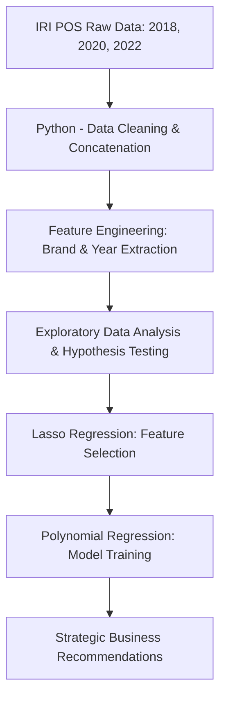

# Predictive Marketing Analytics — Unlocking Growth in Refrigerated Tablespreads

   

> **Empowering Conagra Brands with data-driven portfolio optimization — integrating multi-year IRI POS sales data, regional market indicators, and polynomial regression modeling to predict unit sales performance and identify high-growth strategic opportunities in the refrigerated spreads category.**

---

## Table of Contents

*    [Business Impact](#business-impact)
*    [Project Overview](#project-overview)
*    [Key Findings](#key-findings)
*    [Dataset](#dataset)
*    [Methodology](#methodology)
*    [Technical Architecture](#technical-architecture)
*    [Results](#results)
*    [Repository Structure](#repository-structure)
*    [Getting Started](#getting-started)
*    [Tech Stack](#tech-stack)
*    [Author](#author)

---

## Business Impact

Conagra Brands faces the complex challenge of optimizing a diverse brand portfolio amidst shifting consumer behaviors in the post-pandemic recovery phase. This project delivers a **Predictive Analytics Framework** that directly impacts high-stakes marketing and supply chain decisions:

*    **Portfolio Strategic Alignment:** Identifies which brands (e.g., BlueBonnet, Imperial RFG) demonstrate the highest positive significance on unit volume, enabling data-backed SKU prioritization and investment.
*    **Regional Growth Optimization:** Quantifies regional market disparities, pinpointing the **Northeast** and **Southeast** as high-impact zones for focused marketing spend and distribution expansion.
*    **Price Elasticity Intelligence:** Analyzes the relationship between "No Merch" pricing and unit volume, revealing consumer loyalty patterns that allow for price maintenance without volume attrition during high-demand cycles.
*    **Merchandising Effectiveness:** Provides a comparative analysis of merchandised vs. organic shelf presence (No Merch), helping trade marketing teams optimize promotional calendars and retail partner incentives.
*    **Growth Acceleration:** Pinpoints the underlying drivers of a 2022 recovery, offering a roadmap to replicate successful market patterns in lower-performing regions like the Plains.

---

## Project Overview

This project constructs a **comprehensive marketing analytics pipeline** that analyzes ~270,000 observations of IRI POS tablespreads data across 2018 (pre-COVID), 2020 (crisis), and 2022 (recovery). The core objective is to determine if regionality, seasonality, brand equity, and price elasticity can accurately predict unit sales volume without merchandising assistance.

The analytical workflow spans from multi-year data concatenation and rigorous cleaning to advanced feature engineering (brand/temporal extraction) and predictive modeling using **Lasso** for feature selection and **Polynomial Regression** for high-accuracy sales forecasting.

---

## Key Findings

| Finding | Detail |
| :--- | :--- |
| **Dataset Scale** | ~270,000 observations representing refrigerated spreads POS data |
| **Temporal Scope** | Longitudinal analysis across three critical phases: 2018 (Baseline), 2020 (Peak Demand), 2022 (Recovery) |
| **Best Model** | **Polynomial Regression** achieved **~81% accuracy** in predicting Unit Sales (No Merch) |
| **Top Regions** | **Northeast** and **Southeast** regions demonstrated the strongest positive effect on sales performance |
| **Key Brand Driver** | **BlueBonnet** emerged as the most significant brand contributor to unit volume in Lasso modeling |
| **Price Insight** | Price per Unit (No Merch) maintained a positive correlation with sales during 2020, indicating high brand resilience |
| **Merch Impact** | Non-merchandised distribution magnitude outperformed merchandised distribution in driving sustained volume |

---

## Dataset

> **Note: The data utilized in this project is based on IRI POS Tablespreads records, covering refrigerated spread products across regional US markets.**

| Source | Description | Observations |
| :--- | :--- | :--- |
| `IRI POS Data (2018/20/22)` | Multi-year retail point-of-sale data for tablespreads category | ~270,000 |
| `Regional Indicators` | Qualitative geography markers (Southeast, Northeast, Plains, etc.) | 8 Regions |
| `Brand Data` | High-cardinality brand labels extracted from product descriptions | 20+ Brands |

**Key Features for Modeling:**
*   • `Unit Sales No Merch` - Target Variable (Volume without promotion)
*   • `Base Volume Sales` - Core baseline demand indicator
*   • `Price per Unit No Merch` - Strategic pricing feature
*   • `ACV Weighted Distribution` - Store shelf-presence metric
*   • `Regions & Years` - Contextual dummy-encoded variables

---

## Methodology

### 1. Data Engineering & Preprocessing
*    **Multi-Year Integration:** Concatenated 2018, 2020, and 2022 POS datasets to capture long-term trends.
*    **Cleaning:** Applied rigorous null handling (filling with 0 where appropriate) and duplicate removal.
*    **Feature Extraction:** Engineered brand labels and year/week features from raw product and time descriptions.
*    **Segmentation:** Excluded "Total US" to prevent aggregation bias and focus on regional market dynamics.

### 2. Statistical Analysis & EDA
*    **Hypothesis Testing:** Conducted **ANOVA** and **T-Tests** (p < 0.05) confirming that regional and annual sales variations are statistically significant.
*    **Correlation Analysis:** Identified strong collinearity between Base Volume and Units, requiring careful feature selection.
*    **Trend Benchmarking:** Documented a consistent rise in mean Dollar Sales and Price despite brand count consolidation.

### 3. Predictive Modeling
*    **Lasso Regression:** Implemented for automated feature selection, identifying the most influential brands and regions.
*    **Linear Regression:** Established baseline coefficients for price and ACV distribution impact.
*    **Polynomial Regression:** Developed the final production-grade model to capture non-linear relationships, achieving **81% predictive accuracy**.

---

## Technical Architecture



---

## Results

| Model | Evaluation Metric | Result |
| :--- | :--- | :--- |
| **Polynomial Regression** | **Accuracy (R² / Prediction)** | **~81%** |
| Lasso Regression | Feature Importance | Identified BlueBonnet & Northeast as top drivers |
| Linear Regression | Baseline RMSE | Provided direct coefficient interpretability |

---

## Repository Structure

```text
Predictive-analytics-Data-Science-Project/
├── Group16_PA_Tablespreads.ipynb  # Primary Python modeling pipeline
├── Group16 Project Report.pdf     # Detailed technical report & business analysis
├── Final Presentation_predictive.pptx # Executive stakeholder presentation
├── Group16_PA_Tablespreads.py     # Script version of the analysis
└── README.md                      # Project documentation
```

---

## Getting Started

### Prerequisites
```bash
pip install pandas numpy scikit-learn matplotlib seaborn statsmodels
```

### Execution
1.  Open `Group16_PA_Tablespreads.ipynb` in a Jupyter environment.
2.  Ensure dataset paths match your local directory.
3.  Run all cells to replicate the EDA, statistical tests, and modeling results.

---

## Tech Stack

| Layer | Technology |
| :--- | :--- |
| **Data Science** | Python, Pandas, NumPy |
| **Machine Learning** | Scikit-learn, Statsmodels |
| **Visualization** | Matplotlib, Seaborn |
| **Environment** | Jupyter Notebook |

---

## Author

**Manoj Mareedu** — Data Scientist / ML Engineer
[GitHub](https://github.com/ManojMareedu) | [LinkedIn](https://www.linkedin.com/in/manojmareedu/)

*Developed as part of a Predictive Analytics project at the University of Texas at Dallas.*
